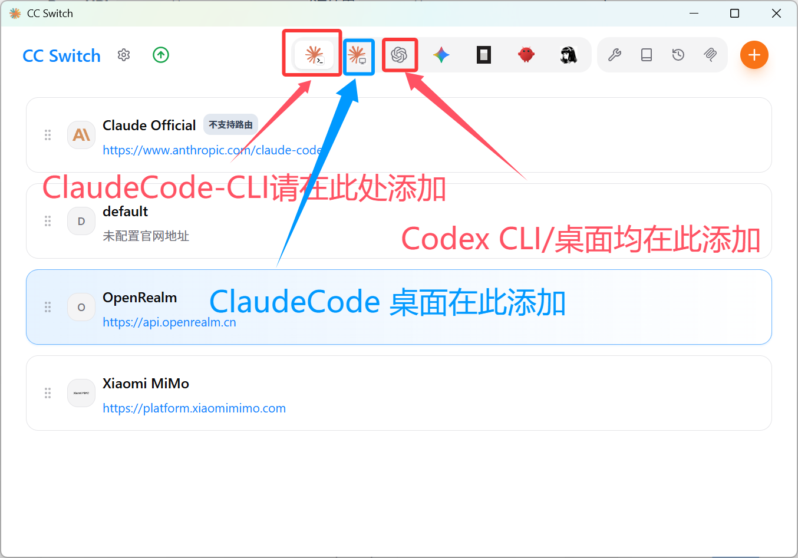
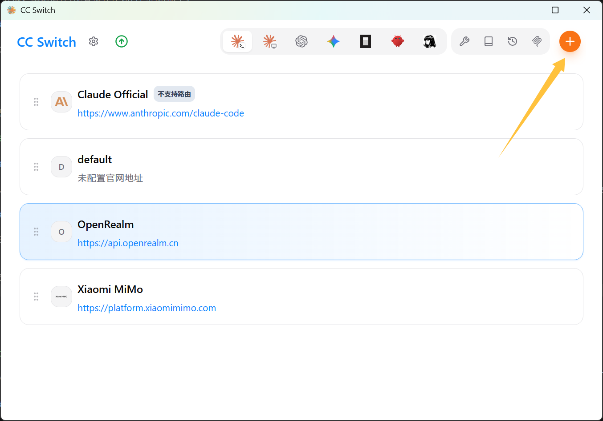
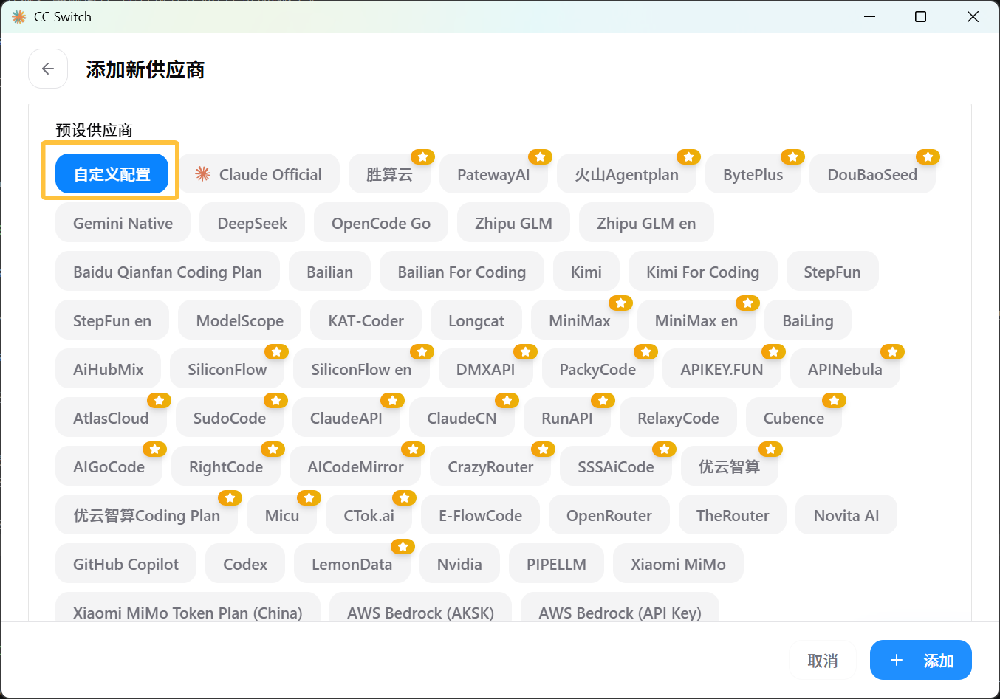
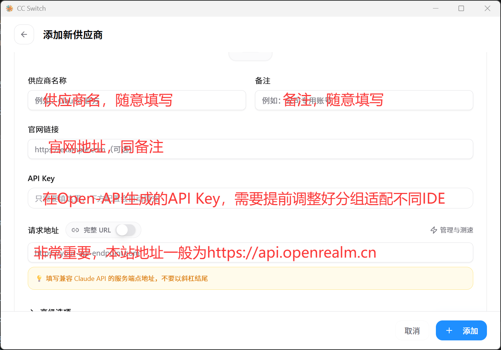
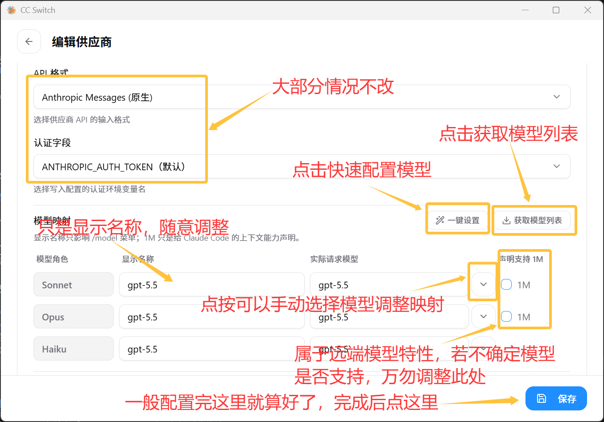
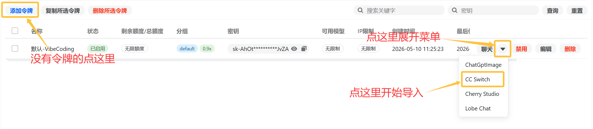
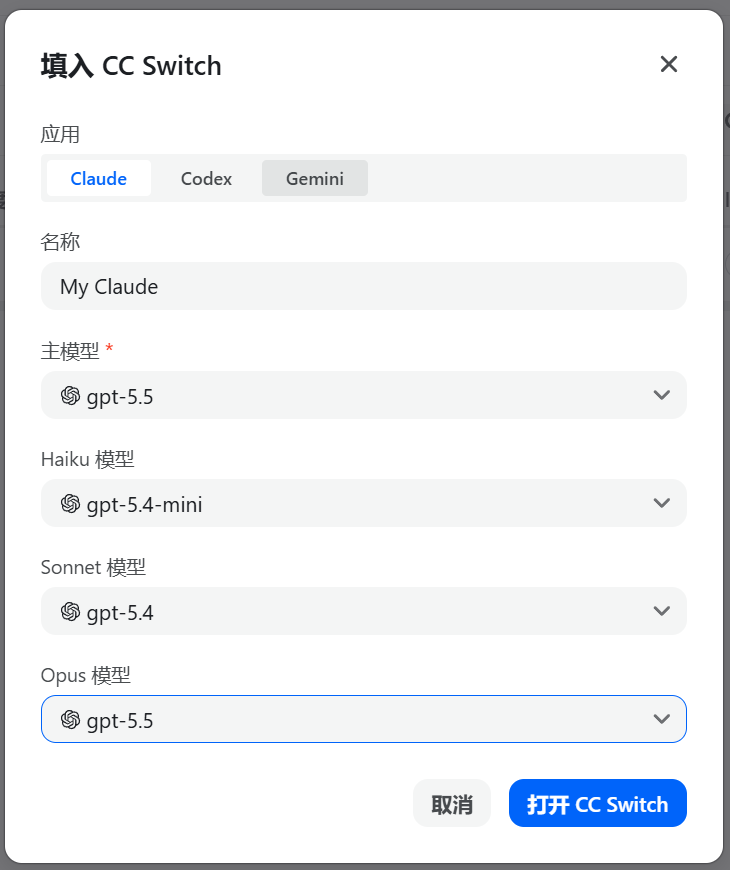
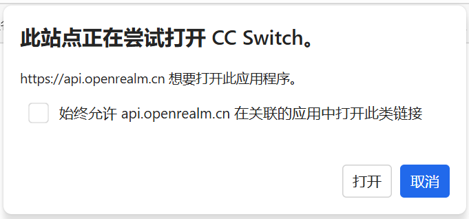
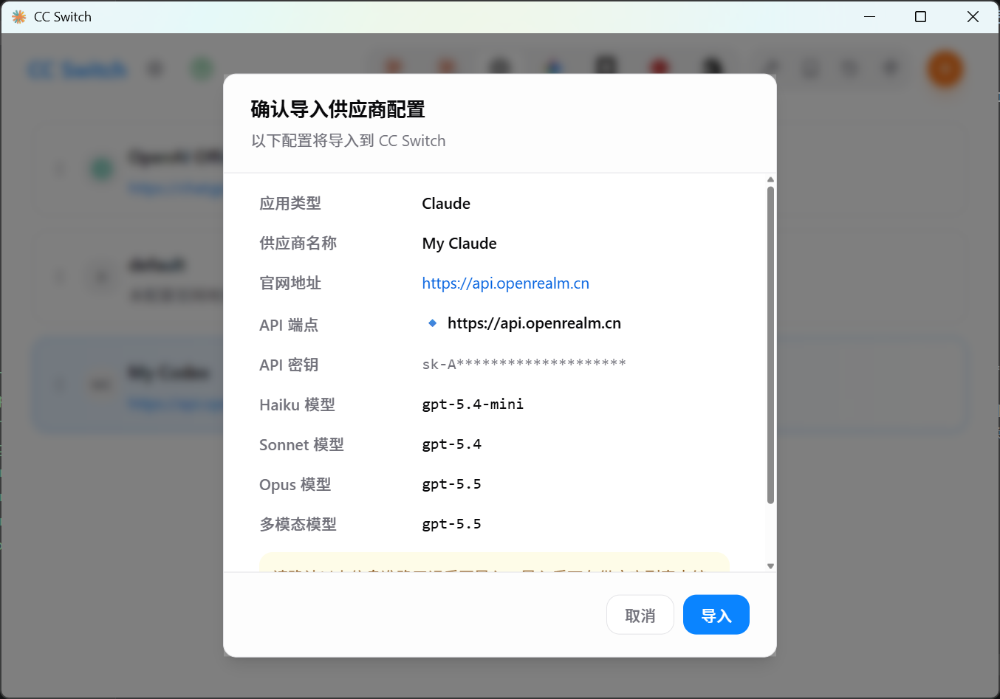

import { Steps, Callout } from 'nextra/components'
import { ConfigShot } from '../../components/Mockup'

# 用 CC Switch 管理 OpenApi 配置

如果你会在多个供应商或多套配置之间频繁切换,手动改环境变量会很麻烦。**CC Switch** 是一个开源桌面工具,专门用来集中保存多套服务商配置,并在它们之间一键切换 —— 很适合把 OpenApi 作为其中一套配置纳入管理。

<Callout type="info">
  CC Switch 是**第三方开源项目**(MIT 许可),与 OpenRealm 无从属关系,本页内容为原创整理。请以其官方资料为准:
  [官网 ccswitch.io](https://ccswitch.io) · [GitHub 仓库](https://github.com/farion1231/cc-switch)。
</Callout>

在 CC Switch 中,把 OpenApi 存成一套配置,关键就是这两栏:

<ConfigShot
  app="CC Switch · 新增配置"
  baseLabel="Base URL"
  base="https://api.openrealm.cn"
  keyLabel="Token"
  model="（用于 Claude Code,地址不带 /v1）"
  caption="给配置起名「OpenApi-主站」,方便和其他供应商区分"
/>

## 它是什么

- 一个跨平台(基于 Rust / Tauri 构建)的桌面应用,用于**管理 Claude Code、Codex 等工具的供应商配置**。
- 核心价值是**一键切换**:把每个服务商存成一套配置,需要时点一下就切过去,免去反复修改环境变量或配置文件。
- 开源、本地运行,配置保存在你自己的机器上。

## 接入思路

CC Switch 负责「保存与切换配置」,真正的接入参数还是 OpenApi 那两样:

- **Base URL**:`https://api.openrealm.cn`(海外用 `https://global.api.openrealm.cn`)
- **API Key**:你的 `sk-...` 令牌

把这两个值在 CC Switch 里存成一套指向 OpenApi 的配置即可。

<Steps>

### 安装 CC Switch

从 [官网](https://ccswitch.io) 或 [GitHub Releases](https://github.com/farion1231/cc-switch/releases) 下载对应平台的安装包并安装。

### 方案一 - 新建一套指向 OpenApi 的配置

在 CC Switch 中新增一个供应商 / 配置项,把地址填为 OpenApi 站点根、密钥填为你的令牌（以Claude Code CLI为例）:
- *不同客户端添加CC Switch配置的示例图如下*
- 
按以下图文示例填写各项信息
*Step1：*
- 
*Step2：*
- 
- 
- 地址(Base URL):`https://api.openrealm.cn`
- 密钥(Token / Key):`sk-...`
- 取个好认的名字,例如「OpenApi-主站」「OpenApi-Global」,方便区分线路。
- 在设置模型时，您可能会遇到**使用模型非IDE原生模型**（如在CC上使用GPT）~~NTR+1~~，此时需要按下图调整**高级设置**配置模型映射
- 

### 方案二 - 使用Open-API的自动配置
在 Open-API站点 的 令牌管理 标签页尝试自动添加
- 展开密钥栏 聊天 按钮旁边的三角按钮，选“CC Switch”，没有密钥则必须先创建密钥才能继续
- 
- 按自己的喜好选择模型后，点按按钮打开CC Switch
- 
- 弹出此窗口时请务必点击打开**千万不要顺手点蓝色的按钮了**
- 
- 确认信息无误后导入
- 

<Callout type="warning">
  用于 Claude Code 的配置,地址填到**站点根(不带 `/v1`)**;Claude Code 会自行拼接 `/v1/messages`。这与 [Claude Code 接入](/clients/claude-code) 里手动设环境变量是同一套参数,只是改由 CC Switch 托管。
  **自动配置添加完成的渠道不是一定可用的，它和手工渠道一样需要经过测试**
  *对表单的特别提醒：绝大多数情况下请求地址末尾不需要加/v1，模型有特殊标注的，按模型标注执行*
  *为什么没讲JSON/TOML处的高级设置？——因为本篇文档的目的是为了让用户以最快速度用上好用的模型，而不是专业教学，且各高级功能在不同模型下表现不一，难以形成可靠文档，望读者见谅*
  *请注意，高级选项中的API格式一般不需要更改的原因是Open-API站点在大多数情况下支持常见API格式到格式转换，但部分特别标记的模型除外——它们可能必须使用特殊的请求格式*
按如下图文配置启用配置
</Callout>

### 切换并启动

在 CC Switch 中把当前配置切到刚建的「OpenApi」,然后正常启动你的工具(如 `claude`)。验证方法与 [Claude Code 接入](/clients/claude-code#验证是否走的是-openapi) 一致。

</Steps>

## 小技巧:为两条线路各存一套

把主站和 Global 各存成一套配置(名字带上线路),网络环境变化时直接切换,比改地址快得多。哪条线路更快,可在 [首页测速](/) 处就地测一下。

<Callout type="info">
  CC Switch 的界面与功能可能随版本更新而变化,具体操作请以 [官方文档](https://ccswitch.io/zh/docs) 为准。
</Callout>
